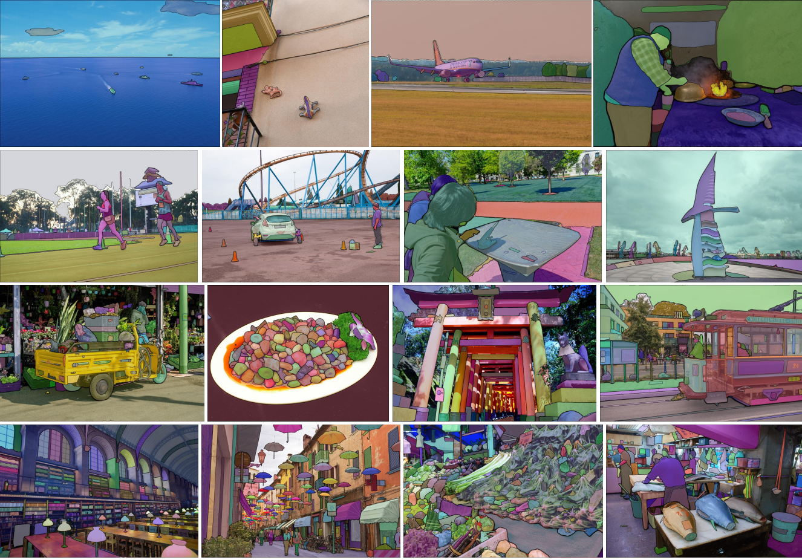
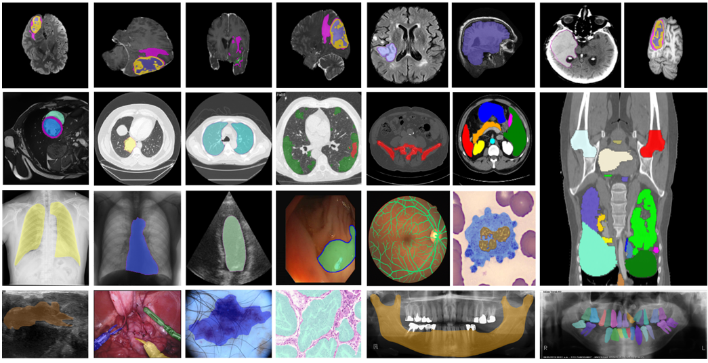

# Hi there! 👋 Nice to have you here.

## Welcome to my GitHub Universe! 🚀

I'm **ScholarChen20**, a passionate computer science student based in Shenzhen, exploring the endless possibilities of code and creativity.

### 🔥 What I’m Up To Currently:
- 🎓 Wrapping up my Computer Engineering Postgraduate Degree  
- 🤖 Diving deep into **AI, Computer Vision & Machine Learning** through hands-on projects and courses  
- 🐧 Sharpening my **Linux & systems programming** chops for upcoming internships  
- 🌱 Growing my own open-source tools and automation scripts

### 🚀 My Current Challenges:
- 🌅 Building a **5 AM coding routine** for maximum productivity  
- ⌨️ **#100DaysOfCode** – committing daily to public projects  
- 🧠 Learning one new tech stack each month (currently: **Rust + WebAssembly**)  
- 📚 Finishing **2 tech books & 1 sci-fi novel** every month

#### ⚙️ Programming languages and tools: 

<code></code>
<code></code>
<code></code>
<code></code>
 
<code></code>
<code></code>
<code></code>
<code></code>
 
<code></code>
<code></code>
<code></code>
<code></code>

### 📊 GitHub Highlights:

| Metric                | Count |
|-----------------------|-------|
| 🌟 Stars Earned       | 27    |
| 📦 Contributed to     | 123   |
| 🧑‍💻 Annual Commit Count| 20    |
| 🔀 Pull Requests      | 5     |
| 🐛 Issues Opened      | 4     |

### 📌 Pinned Projects ↓

#### 💡 Fun Fact:
I once built a neural network to generate memes. It was hilarious… until it wasn’t.

Let’s build the future together — one commit at a time. ⚡
